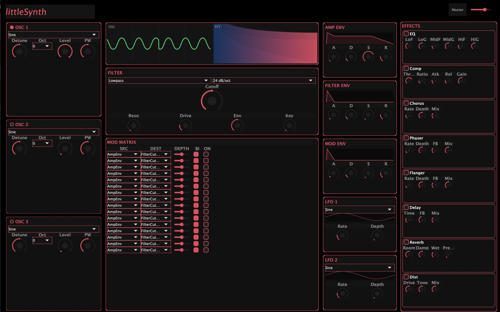

# littleSynth

**A polyphonic subtractive synthesizer plugin — small in name, big in sound.**

littleSynth is a VST3 synthesizer plugin built with [JUCE 8](https://github.com/juce-framework/JUCE) and [DaisySP](https://github.com/electro-smith/DaisySP). It packs a full subtractive synthesis signal chain — three oscillators, a multi-mode filter, a 16-slot modulation matrix, and eight insert effects — into a dark-themed GUI with a real-time oscilloscope and FFT spectrum analyzer.




---

## Features

### Sound Engine

- **3 Oscillators per voice** — Sine, Triangle, Saw, Square, and Noise waveforms with anti-aliased rendering, per-oscillator detune, octave shift, and pulse width control
- **Multi-mode Filter** — Ladder (Lowpass) and SVF (Highpass, Bandpass, Notch) topologies with 12/24 dB per octave slopes, adjustable drive, and keyboard tracking
- **3 ADSR Envelopes** — Amp, Filter, and Modulation envelopes using DaisySP's ADSR implementation
- **2 LFOs** — Multiple waveshapes including Sample & Hold and Random, routable to any modulation destination
- **16-slot Modulation Matrix** — Map sources (envelopes, LFOs, velocity, mod wheel, aftertouch, pitch bend) to destinations (osc pitch/level, filter cutoff/resonance, amp, LFO rate/depth, pan) with bipolar and unipolar support

### Effects Chain

Eight insert effects in a fixed-order chain, applied to the summed voice output:

| # | Effect | Engine |
|---|--------|--------|
| 1 | Parametric EQ | JUCE `dsp` |
| 2 | Compressor | JUCE `dsp` |
| 3 | Chorus | DaisySP |
| 4 | Phaser | DaisySP |
| 5 | Flanger | DaisySP |
| 6 | Delay | JUCE `dsp` |
| 7 | Reverb | JUCE `dsp` |
| 8 | Distortion | Custom (soft clip, hard clip, waveshaper) |

### Voice Architecture

- 16-voice polyphony with oldest-active-first voice stealing
- Full MIDI note-on/note-off and velocity support

### GUI

- Dark theme with animated rotary knobs and value arcs
- Real-time oscilloscope and FFT spectrum analyzer background
- Dedicated panels for oscillators, filter, envelopes, LFOs, modulation matrix, and effects
- **Preset browser** — overlay panel with grouped category navigation and 40+ factory presets across 8 categories

### Presets

40 factory presets organized into 8 categories:

| Category | Presets |
|----------|---------|
| Factory | Init |
| Pads | Warm Pad, String Ensemble, Dark Atmosphere, Shimmer Pad, Ethereal Pad, Frozen Pad |
| Bass | Bass, Sub Bass, Acid Bass, Reese Bass, Pluck Bass, Wobble Bass |
| Lead | Lead, Supersaw Lead, Brass Lead, Pluck Lead, Siren Lead, Sync Lead |
| Keys | Electric Piano, Clavinet, Bell Keys, Soft Keys, Digital Keys |
| Organ | Church Organ, Jazz Organ, Rock Organ, Gospel Organ, Farfisa |
| FX | Noise Sweep, Laser, Wind, Glitch, Impact |
| Ambient | Ambient, Deep Drone, Crystal, Space Texture, Ocean Pad, Nebula |

User presets can be saved and organized by category from within the plugin.

### Signal Flow

```
┌──────────────────────────────────────────────────────────┐
│                       Per Voice                          │
│                                                          │
│  OSC 1 ─┐                                                │
│  OSC 2 ─┼─→ Mix ─→ Filter ─→ Amp Envelope ─→ Voice Out │
│  OSC 3 ─┘       (LP/HP/BP/Notch)                        │
└──────────────────────────────────────────────────────────┘
                            │
                   All voices summed
                            │
                            ▼
   EQ → Compressor → Chorus → Phaser → Flanger → Delay → Reverb → Distortion → Master Out
```

---

## Building

### Prerequisites

- **CMake** 3.22 or newer
- **C++17** compatible compiler (GCC 9+, Clang 10+, MSVC 2019+)
- **Ninja** (recommended) or your preferred build system

### Clone with dependencies

Third-party libraries are not bundled — clone them into `ThirdParty/` before building:

```bash
git clone https://github.com/your-org/littleSynth.git
cd littleSynth
git clone https://github.com/juce-framework/JUCE.git ThirdParty/JUCE
git clone https://github.com/electro-smith/DaisySP.git ThirdParty/DaisySP
```

### Compile

```bash
cmake -B build -G Ninja -DCMAKE_BUILD_TYPE=Release
cmake --build build
```

The VST3 plugin and Standalone app are built and automatically copied to your system plugin directories (`COPY_PLUGIN_AFTER_BUILD` is enabled).

---

## Architecture

| Component | File | Description |
|-----------|------|-------------|
| Plugin Processor | `Source/PluginProcessor.h` | JUCE `AudioProcessor` — owns the voice manager, effects chain, and parameter tree |
| Preset Manager | `Source/PresetManager.h` | Factory + user preset management, save/load, category scanning |
| Voice Manager | `Source/VoiceManager.h` | Extends `juce::Synthesiser` with 16 voices and voice stealing |
| Synth Voice | `Source/SynthVoice.h` | Single voice: 3 oscillators, filter, 3 envelopes, 2 LFOs, modulation matrix |
| Parameters | `Source/Parameters.cpp` | 50+ parameters defined via `AudioProcessorValueTreeState` |
| Mod Matrix | `Source/ModMatrix.h` | 16-slot source-to-destination mapping with bipolar/unipolar support |
| Effects Chain | `Source/EffectsChain.h` | Manages the 8-effect insert chain |
| DSP Wrappers | `Source/Oscillator.h`, `Filter.h`, `Envelope.h`, `LFO.h` | DaisySP DSP bound to JUCE parameters |
| GUI | `Source/GUI/` | Panel-based dark theme with visualizer and preset browser |

### Compatibility

On Linux, `Source/glibc_compat.c` provides shims for C23 string functions required on systems with GLIBC < 2.38 (e.g., the Ardour snap package). The plugin is statically linked against the C++ runtime to avoid conflicts with a host's older `libstdc++`.

---

## License

littleSynth is released under the [MIT License](LICENSE).

Copyright (c) 2026 Andy Poots
